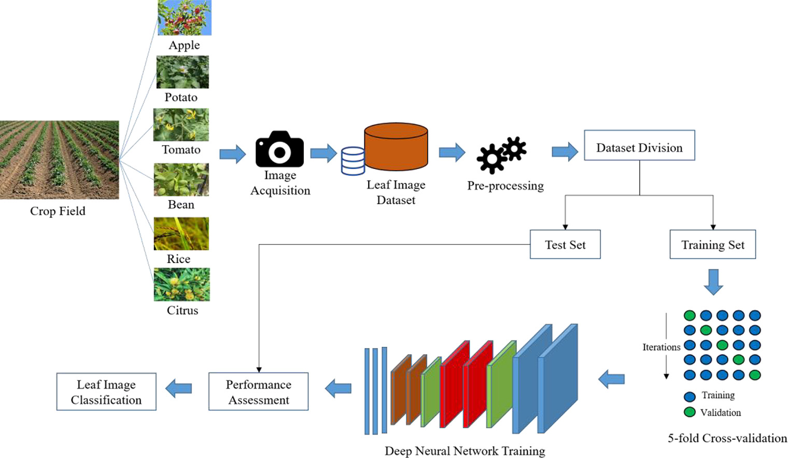
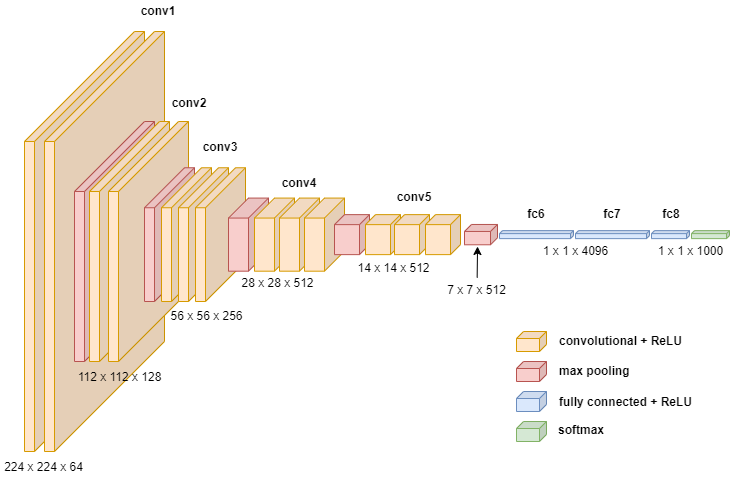

# Plant Disease Detection and Prediction


## Overview

This project is a machine learning application designed to predict plant diseases from images using a Convolutional Neural Network (CNN). The goal is to help farmers and agriculturists quickly identify diseases in their crops and take appropriate action to mitigate losses.

## Features

- **Automated Disease Detection**: Upload an image of a plant leaf to receive an immediate diagnosis.
- **User-friendly Interface**: Easy-to-use web interface for uploading images and viewing predictions.
- **Accurate Predictions**: The model is trained on a comprehensive dataset to ensure high accuracy.

## Dataset

The dataset consists of 80K RGB images of plant leaves categorized by disease type. It is divided into training and testing sets to evaluate the model's performance.
The training set consists of 70,292 RGB images, representing 80% of the dataset, while the test set comprises 17,573 RGB images, making up the remaining 20%.
Here is the link of the dataset: [Tap Here](https://www.kaggle.com/datasets/vipoooool/new-plant-diseases-dataset)


## These are the image pre process steps 


## Model Architecture


The CNN model is built with the following layers:

- **Convolutional Layers**: For feature extraction from images.
- **Pooling Layers**: For reducing the dimensionality of the feature maps.
- **Softmax Layer**: For outputting disease probabilities.
- **Ful!ly Connected Layers**: For classification.

### Graph of the Model Training and Model Loss
For our model training process, I employed the Adam optimization strategy, which is well known for its efficiency and smoother convergence when compared to alternative approaches. Ten training epochs were used to train the model, which led to increasing accuracy and decreasing loss functions on each run. 22,294 photos total from our collection were split into classes representing healthy and ill plant leaves. Positive trends were shown during the validation and training phases. Training and validation losses decreased as training and validation accuracy, as seen in Figures. These findings show how well the model learned from the data.
# Model Loss Graph

# Model Accuracy Graph


# These are the sample output screenshot of the model


## Installation

Follow these steps to set up the project locally:
 
### Prerequisites

- Python 3.7+
- TensorFlow 2.0+
- Flask
- OpenCV

### Clone the Repository

```bash
git clone https://github.com/PritishDoc/plant-disease-detection.git
cd plant-disease-detection
